# HTML
## Serise of a HTML by apna college.
## What is <mark>HTML</mark>?
HTML stands for HyperText Markup language, used to structure & format web pages.   

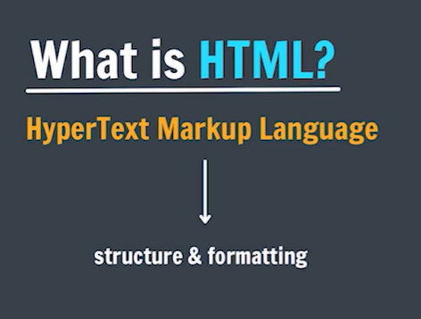  
<!-- 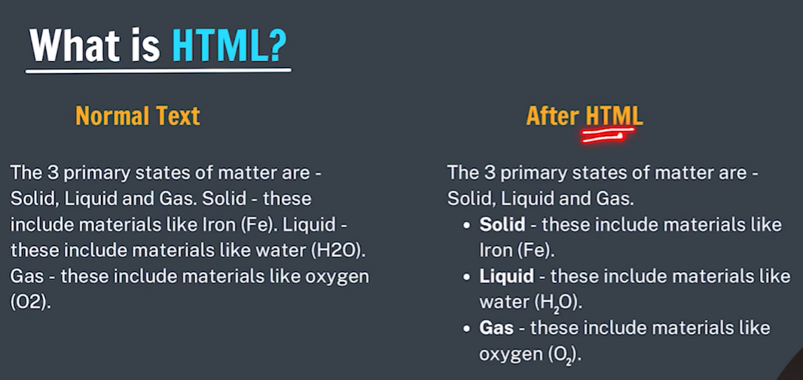 -->

## HTML Elements
The HTML element is everything from the start tag to the end tag:   
`<tagname>Content goes here...</tagname> `  

standard Elements that browser recognizes:  

- Paragraph `(<p> text </p>)`
- Heading `(<h1> text </h1>)`
- Image `()`

### HTML Tags :
The component used to design the structure of website are called HTML tags.

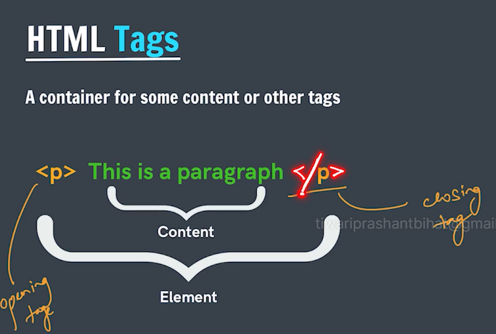

- We use `<b></b>` tag to  make text bold.
- Extension for the HTML file is .htm or .html, both will work.
- nesting => nested tags.

## Paragraph Element 
- The `<p>` HTML element represent a paragraph.

## Heading Element
- The `<h1> to <h6>` HTML elements represents six levels of section headings.
`<h1>` is the highest section level and `<h6>` is the lowest.

- Try to keep only one `<h1>` in a page.

## List in HTML

### Unordered List
- `<ul>` -> for unordered list
- `<li>` -> list item

### Ordered List
- `<ol>` -> for ordered list
- `<li>` -> list item

- we use `type` attribute to specify the bullet type.  

    `<ol type="a">` =>circle, disc, square, none, a, A, 1, i, I, etc.

## HTML Attribute

<mark>Attributes</mark> are used to add more information to the tag.

`<html lang="en">`

## Anchor Element

Used to add links to your page  
`<a href="https://google.com">Google</a>`  
href is known as <mark style="background-color: lightblue;">hypertext reference</mark>.  
href contains two types of links:  

- Absolute --> internet
- Relative --> file

## Image Element

Used to add image to your web page.  
``  
`src="image.png"` -->relative URL  
src stands for source of image and alt stands for alternate text. 

## Br Tag

Used to add next line (line breaks) to your page  
`<br>`

## Bold, Italic & Underline Tags

Used to highlight text in your page  
`<b> Bold </b>`  
`<i> Italic </i>`  
`<u> Underline </u>`

## Comments in HTML

`<!-- text -->`

shortcut --> Ctrl + /

/ --> forward slash  
\ --> backward slash

## Resources

[MDN](https://developer.mozilla.org/en-US/)

## HTML is not Case Sensitive 

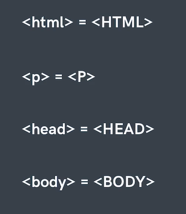

but recommended in lower case.

## Assignment HTML Level 1

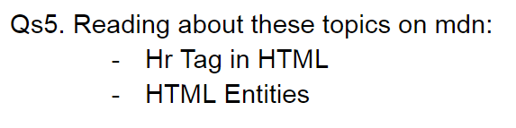

## Inline v/s Block

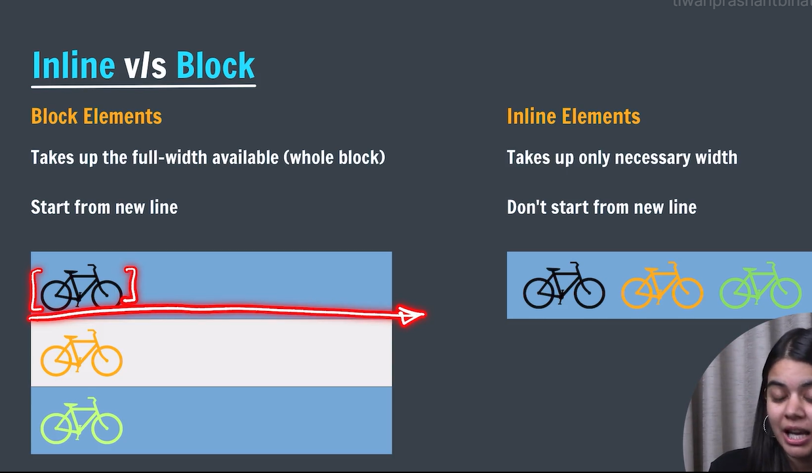

## Block element

   heading `<h1>` and paragraph `<p>` are block element.

## Inline Element 

`<a>` and `` are inline elements.

## Div Element

Div is also known as the content division element   
Div is a <mark>container</mark> used to hold other HTML elements or group elements together. It is a <mark>block</div> element.   


```html
    <div>  
        <a href="https://www.google.com">Google</a>
        <a href="https://www.youtube.com">Youtube</a>
    </div>
```
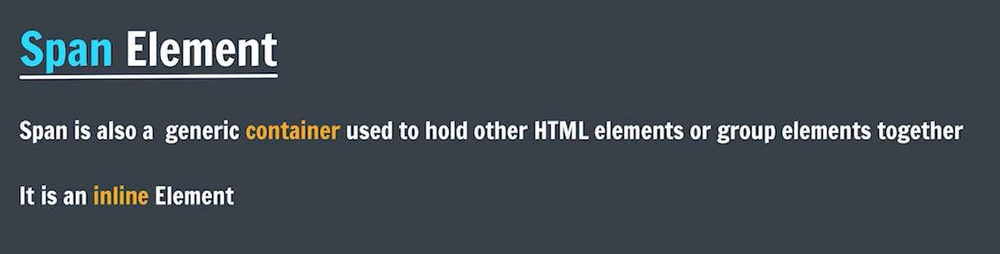

## Hr Tag

Horizontal Rule Element   
`<hr>`

## Sub & Sup Tag

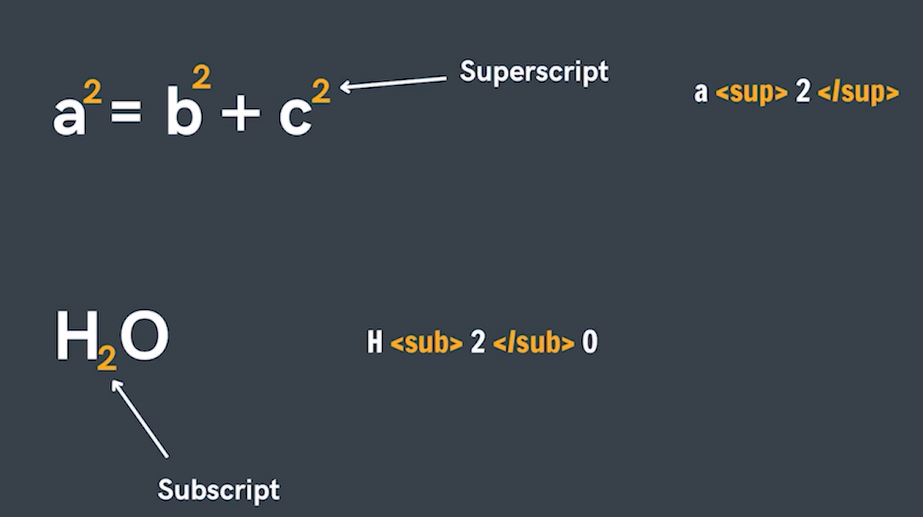

## Semantic Markup

It is the markup that relates to the meaning of content.  
1. Semantic 
2. non-semantic

#### Benifits of using Semantic tags:
1. (meaningful / structured layout)
1. SEO friendly
1. readable + screen reader (better UX)


## Semantic Tags

- `<header></header>`
- `<main></main>`
- `<footer></footer>`
- `<nav></nav>`
- `<article></article>`
- `<section></section>`
- `<aside></aside>`

Try to make only one header, footer, and main tag.

## HTML Entities:

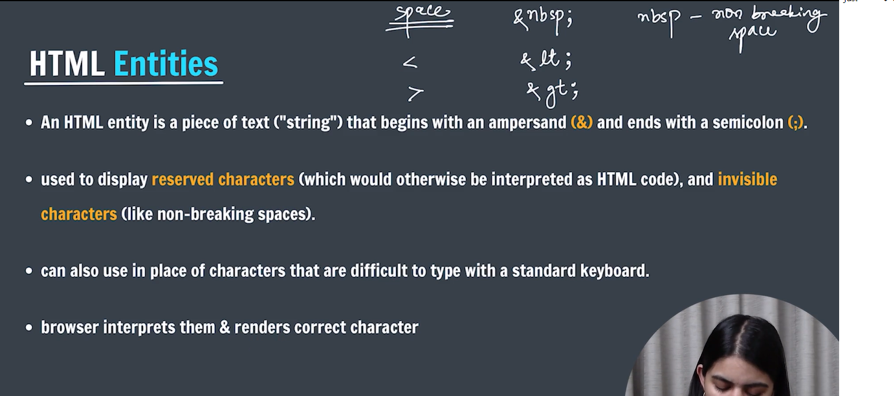
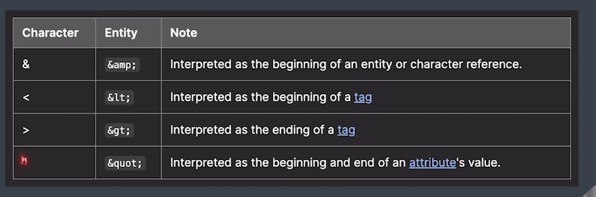

## Emmet

emmet.io
[Emmet](https://emmet.io/)

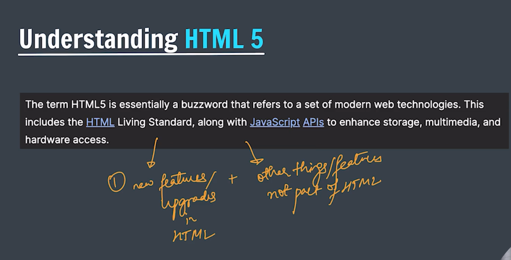

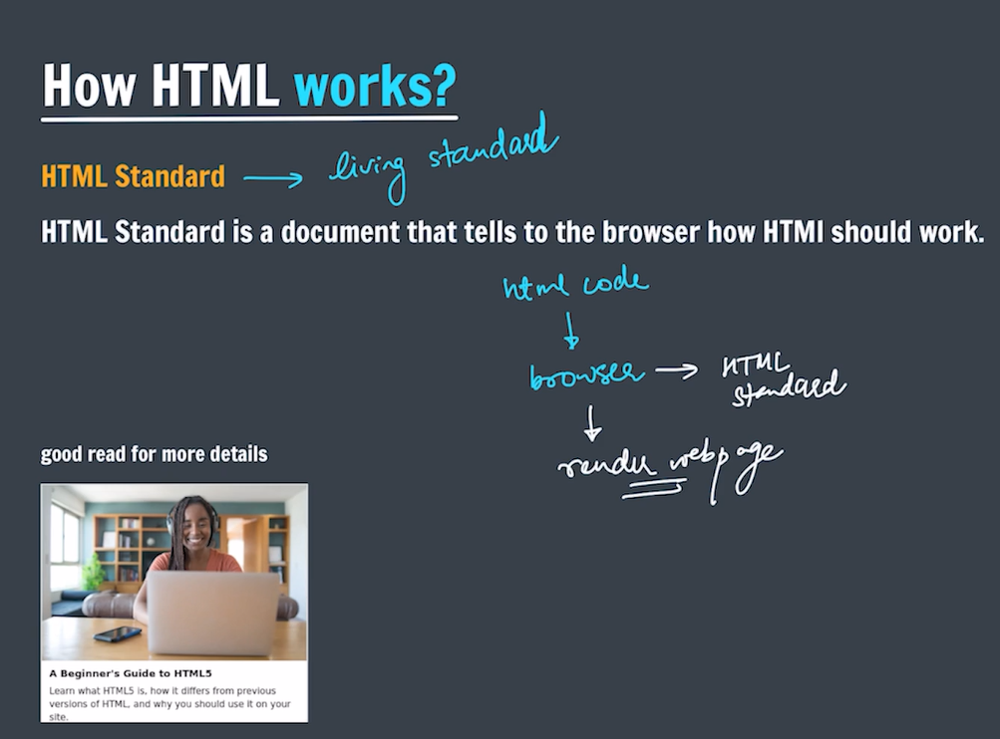

## Table:

Tables are used to represent real life table data. It is a combination of rows and columns.  

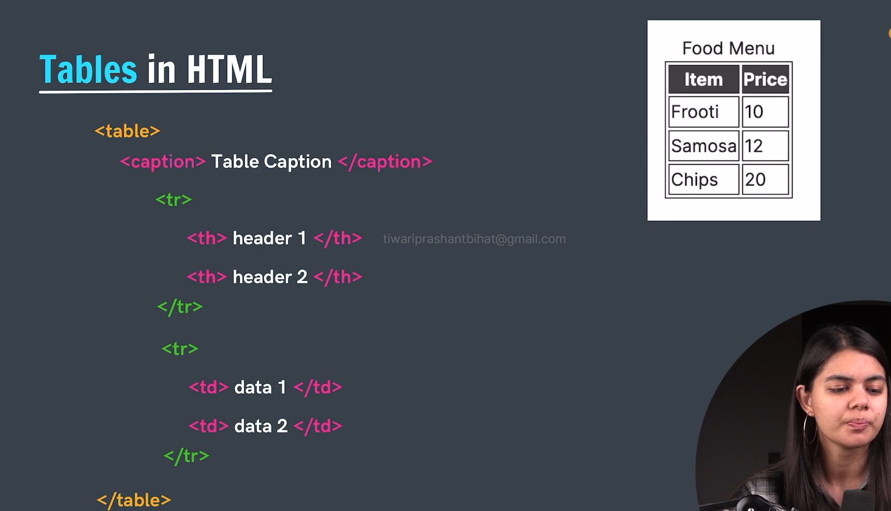

`<tr>` used to display table row     
`<td>` used to display table data     
`<th>` used to display table header    
`<caption>` used to display table caption/heading   

### Semantics in table

`<thead>` to wrap table header  
`<tbody>` to wrap table body  
`<tfoot>` to wrap table footer  

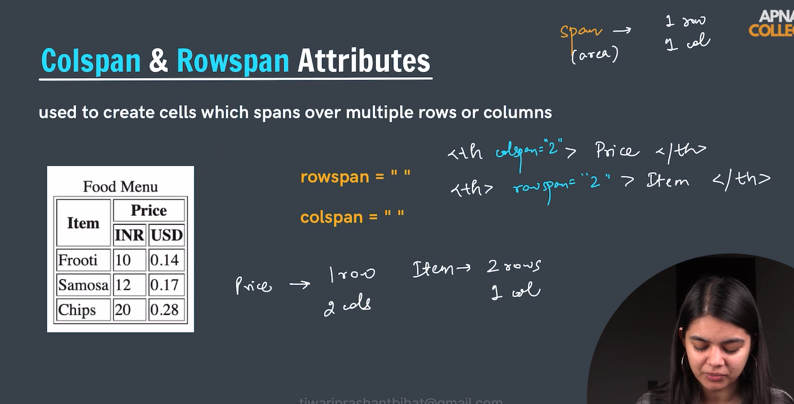


## Forms

Forms are used to collect data from the user.  

`<form>` form content `</form>`  

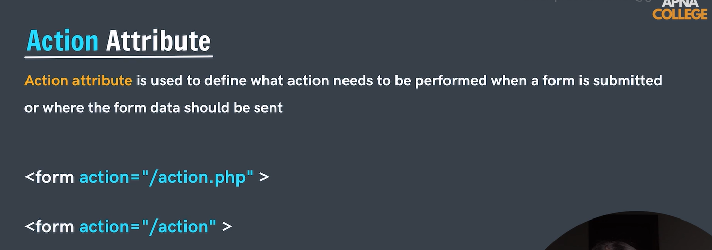

## Form Elements:

### Input

- used to create multiple form controls
- there are multiple types og inputs that can be created using type attribute.

`<input type="text" >`

### type attributes

`<input type="text" >`  
`<input type="password" >`   
`<input type="number" >`   
`<input type="time" >`    
`<input type="color" >`   
`<input type="email" >`

### placeholder attribute

`<input type="email" placeholder="enter email">`

 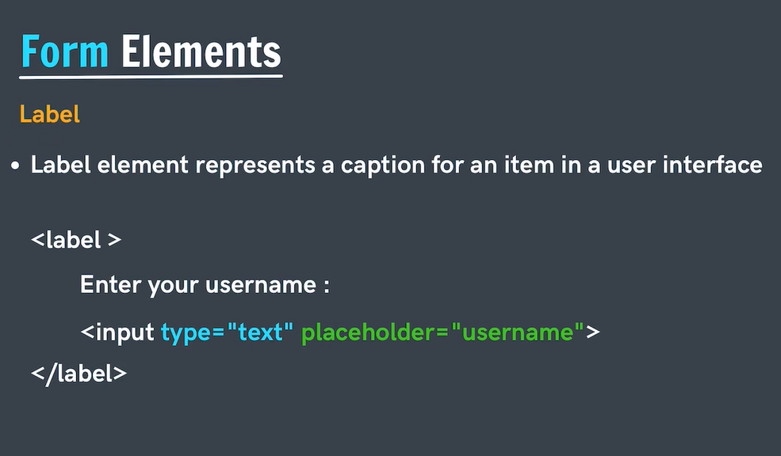

 ```
    <label for="username">Username</label>
    <input type="text" placeholder="enter username" id="username">
 ```

 for will be mapped with id attribute.    

 ## Button :

 inside the form behaviour of button to submit the form data except reset button  
 ```
 <button>Submit</button>
 <button>Hello</button>
 ```

 ### type of buttons

 #### type attribute
  
  `<button type="submit">submit</button>` used to submit the information  
  `<button type="button">do something</button>`   
  `<button type="reset">do something</button>` clear the form data  

  #### Button using input

  `<input type="submit">"`  
  `<input type="submit" value="click me>"`  
  `<input type="button" value="click me>"`  

  ## Name Attribute

  Name of the form control. submitted with the form as part of a name/value pair   

  `<input type="text" placeholder="enter username" id="username" name="username">`

  ### checkbox

  ```
   <input type="checkbox" id="age" name="age" checked>
   <label for="age">I am 18+</label>
  ```
  If the checkbox is checked then it sends on and if unchecked it sends nothing.   


## Radio Button

```
 <input type="radio" name="fruit" id="apple" value="apple">
 <label for="apple">Apple</label>
```

name attribute must be same and value attribute must be given.     
we can also group the checkbox the same as radio but still we can select multiple option.

## Select Element (Dropdown)

```
<select name="profession" id="profession">
    <option >choose your profession</option>
    <option value="SDE" selected>SDE</option>
    <option value="police">Police</option>
    <option value="army">Army</option>
</select>

```

## Input Range

```
<label for="volume">Volume</label>
<input type="range" min="0" max="100" name="vol" step="3 value="10">
```
## textarea

```
 <label for="feedback">Please provide your valuable feedback:</label>   
 <textarea name="feedback" id="feedback" cols="5" rows="2" placeholder="write your feedback here"></textarea>
```