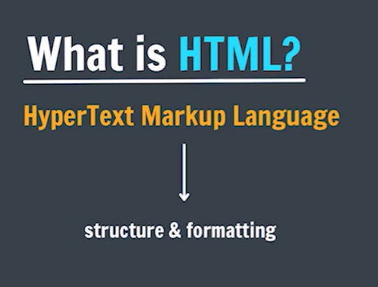

# HTML
## Serise of a HTML by apna college.

## HTML Elements
standard Elements that browser recognizes:

- Paragraph (
 text 
)
- Heading (<h1> text </h1>)
- Image ()

The component used to design the structure of website are called HTML tags.

- We use <b></b> tag to  make text bold.
- Extension for the HTML file is .htm or .html, both will work.
- nesting => nested tags.

## Paragraph Element 
- The 
 HTML element represent a paragraph.

## Heading Element
- The <h1> to <h6> HTML elements represents six levels of section headings.
<h1> is the highest section level and <h6> is the lowest.

- Try to keep only one <h1> in a page.